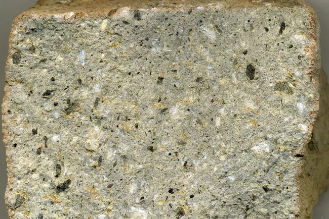
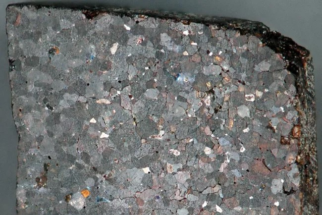
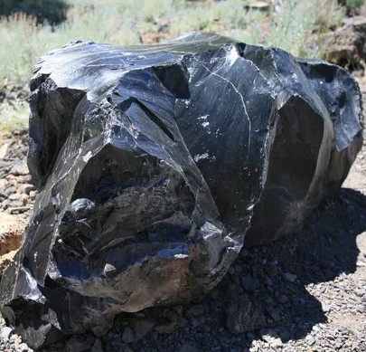
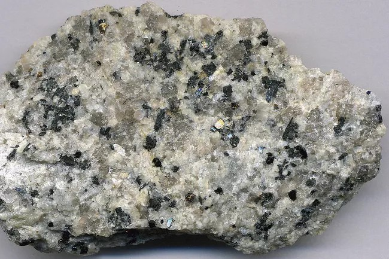
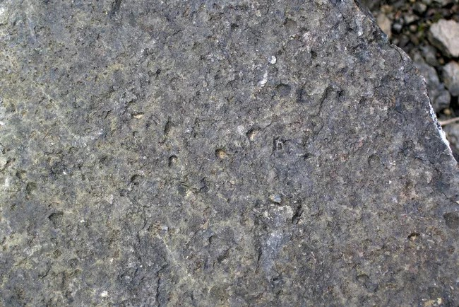
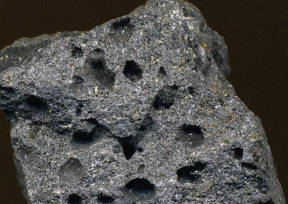

### Important textural types in IGNEOUS ROCKS
Texture is defined on the basis of glass vs. mineral grains proportions, their sizes, shapes and mutual arrangements. These textures and structures provide an idea about the geological processes during its crystallisation. They also provide us valuable information about physical chemistry and cooling history of the igneous rocks.
The articulation of mineral grains is described in terms of planar, smoothly curved, sinuous, sutured, interlocked, or irregular surfaces of mutual boundary. The distribution and orientation of mineral grains and of mineral grains and glass are other elements of fabric that can be useful in estimating the conditions and sequence of mineral formation in igneous rocks
### Crystallinity is largely controlled and governed by following factors:
- Rate of cooling- Faster the cooling finer will be the crystals. Volcanic glass is formed by rapid cooling of the lava. Slower rate of cooling favours crystal growth of the bigger crystals.
- Depth of cooling and volume of magma- Higher the depth, slower will be the cooling rate as heat deccipiation is slow. Similarly, volume of the magma have significant bearing on crystal growth. Larger the volume slower will be the rate of cooling, hence larger crystals will be formed.
- Composition and viscosity of magma- Highly viscous lavas such as rhyolite or siliceous magma favours formation of non-crystalline and/or glassy rocks. Contrarily, less viscous basaltic or mafic lavas/magmas give rise to crystalline rocks e.g. phyric and aphyric basalts. Magma with high viscosity have high volatile content as compared to less viscous magmas
##### The following are only a few of the most important examples:
Directive textures are produced by the preferred orientation of platy, tabular, or elongate mineral grains to yield grossly planar or linear arrangements; they are generally a result of magmatic flowage.
##### Graphic texture
refers to the regular intergrowth of two minerals, one of them generally serving as a host and the other appearing on surfaces of the host as striplike or cuneiform units with grossly consistent orientation; the graphic intergrowth of quartz in alkali feldspar is a good example.
##### Ophitic texture 
is the association of lath-shaped euhedral crystals of plagioclase, grouped radially or in an irregular mesh, with surrounding or interstitial large anhedral crystals of pyroxene; it is characteristic of the common rock type known as diabase.
##### Poikilitic texture
describes the occurrence of one mineral that is irregularly scattered as diversely oriented crystals within much larger host crystals of another mineral.
##### Reaction texture
occur at the corroded margins of crystals, from the corrosive rimming of crystals of one mineral by finer-grained aggregates of another, or as a result of other features that indicate partial removal of crystalline material by reaction with magma or other fluid.
##### Pyroclastic texture
results from the explosive fragmentation of volcanic material, including magma (commonly the light, frothy pumice variety and glass fragments called shards), country rock, and phenocrysts. Fragments less than 2 millimetres in size are called ash, and the rock formed of these is called tuff; fragments between 2 and 64 millimetres are lapilli and the rock is lapillistone; fragments greater than 64 millimetres are called bombs if rounded or blocks if angular, and the corresponding rock is termed agglomerate or pyroclastic breccia, respectively. Commonly, many of these pyroclastic rocks have been formed by dense hot clouds that hug the ground and behave much like a lava flow and hence are given the name pyroclastic flow.
Replacement textures occur where a mineral or mineral aggregate has the external crystal form of a preexisting different mineral (pseudomorphism) or where the juxtaposition of two minerals indicates that one was formed at the expense of the other.
### Aphanitic Texture

 Aphanitic rocks have mineral grains that are mostly too small to be seen with the naked eye or a hand lens, like this Rhyolite. Basalt is another igneous rock with the aphanitic texture. 
### Equigranular Texture

 Rocks with EQUIGRANULAR have mineral grains that are generally the same size. This example is a GRANITE.
### Glassy Texture

 Glassy (or hyaline or vitreous) rocks have no or almost no grains at all, as in this quickly chilled pahoehoe basalt or in OBSIDIAN..
### Phaneritic Texture

 Phaneritic rocks have mineral grains that are large enough to be seen with the naked eye or a hand lens, like this GRANITE
### Poikilitic Texture

 Poikilitic  texture is one in which large crystals, like this feldspar grain, contain small grains of other minerals scattered inside them And it is commonly found in rock  SYENITE.
### Pyroclastic Texture

 Rocks with pyroclastic texture are made of pieces of volcanic material that are created in an explosive eruption, like this welded tuff. Pyroclastic texture results from the explosive fragmentation of volcanic material, including magma (commonly the light, frothy pumice variety and glass fragments called shards), country rock, and phenocrysts.eg-PUMICE
### Vesicular Texture

 Rocks with vesicular texture are full of bubbles. It always indicates a volcanic rock, like this SCORIA.
